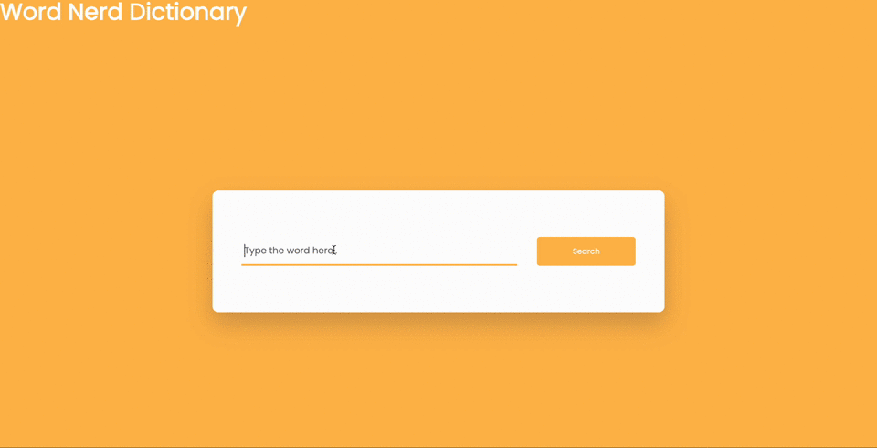

# Word-Nerd: https://j-t-thomas.github.io/Word-Nerd/
HTML5, CSS3, Javascript - Dictionary app that displays english words along with its phonetics.

## How It's Made:

**Tech used:** HTML, CSS, JavaScript

My learning was focused on using an API and creating a responsive button element in Javascript.

## Optimizations

I'm a currently getting my sound play element working so that the app will have the able to say each word that is looked up.

## Lessons Learned:

I learned that a simple application can be successful, it doesn't always need to be complex.

## Other Projects:

